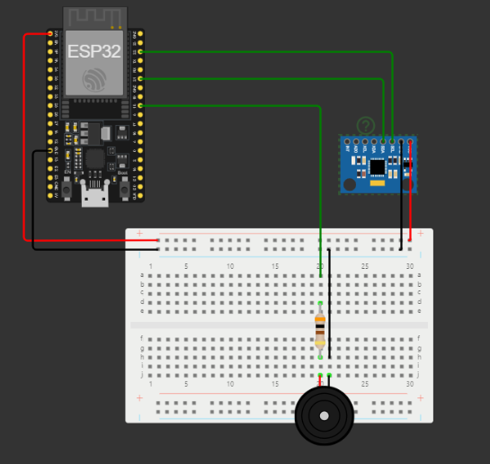

# VitaLink

## Problema abordado:

A mudança de decúbito é a troca de posição do paciente acamado ou restrito ao leito que está incapacitado de realizar a mudança de posição ativa. Segundo estudos, é necessário que seja feita pelo menos a cada 2 horas por profissionais da equipe de enfermagem, cuidadores ou familiares, a fim de prevenir dificuldades futuras. O procedimento tem como objetivo:

- Evitar isquemia em áreas de compressão (prevenindo a necrose tecidual, conhecida como úlcera por pressão)
- Facilitar a expectoração de secreção traqueal e brônquica;
- Impedir o aumento de secreção pulmonar.

As úlceras por pressão possuem 4 principais estágios, variando de um eritema não branqueável até a perda total da espessura dos tecidos, resultando na exposição dos ossos, tendões ou músculos do paciente.

Lesões por pressão representam um significativo problema de saúde mundial, com altos custos hospitalares devido ao prolongamento do tempo de internação, aumento da morbimortalidade, acrescidos do impacto emocional e o sofrimento do paciente, estes percebidos como custos intangíveis, segundo a Scielo.

Ao realizar a mudança da posição do paciente, ocorre uma descompressão dos vasos e retorno da circulação sanguínea, mantendo o tecido saudável e impedindo a abertura de lesões.

## Solução proposta:

Após reflexões sobre o problema enfatizado acima, a solução foi batizada de SmartComfort.

SmartComfort consiste numa "almofada assistente". Desenvolvida anatomicamente pensando no conforto do paciente e sendo posicionada entre os joelhos. Além de gerar um maior conforto ao paciente, ela atuará como um sistema de monitoramento da posição do paciente acamado com pouca ou nenhuma mobilidade ativa. Possuindo internamente um sensor MPU6050 (Acelerômetro/Giroscópio/Temperatura) cuja função é de monitorar a posição que o paciente permanece. Em conjunto com um buzzer, emitirá um alerta sonoro de 2 em 2 horas para a equipe de enfermagem, que será desarmado assim que a mudança da posição do paciente for realizada (juntamente com a almofada, que é onde o sensor está presente).

### Internet:

Além disso, como o dispositivo estará conectado a um ESP32, poderá ser conectado a uma nuvem, enviando alertas através da internet para uma aplicação. Desta forma, alertando sobre a necessidade de mudança de decúbito para enfermeiros e técnicos que não estiverem presentes para receber o alerta sonoro, onde será possível verificar se o trabalho já foi realizado ou se ninguém atendeu ao chamado, vizualizando as informações num Dashboard.

Será cronometrado o tempo levado para a mudança de posição ser realizada desde o momento do acionamento do alerta, até sua desativação pela mudança de decúbito do paciente e a almofada. O intuito do cronometro é de agilizar o processo, aumentando as chances de manter o paciente saudável.

Pensando num controle de monitoramento mais eficiente e visto que ocorrem casos de processos judiciais e indenizações por conta de pacientes que desenvolvem complicações, os dados sobre os alertas, como os horários em que o trabalho foi realizado e quem o fez, serão armazenados históricamente, gerando assim mais provas a favor da justiça.

## Configuração e Execução:

- Utililzar as conexões da imagem postada acima para replicação.

- Implementar o código .ino que se encontra na pasta codigos_fonte do repositório, escolhendo a rede wifi que deseja se conectar na internet.

- No Postman: id - urn:ngsi-ld:smartComfort:001

- Receber os dados na internet em tempo de execução através da porta 1026 (Orion Context Broker) ou dados históricos através da porta 8666 (STH-Comet).

Observação: No código do protótipo, foi implementado o intervalo de tempo de 10 segundos para simular o intervalo de tempo de 2 horas da mudança de posição do paciente. 

## Para a montagem do protótipo foi utilizado:

- 1x ESP32;
- 1x MPU6050;
- 1x Buzzer;
- Cabos jumpers;
- 1x resistor 300 ohms;
- 1x protoboard.

Para acessar a simulação no Wokwi: <a href="https://wokwi.com/projects/381789432577941505">SmartComfort - Wokwi</a>

